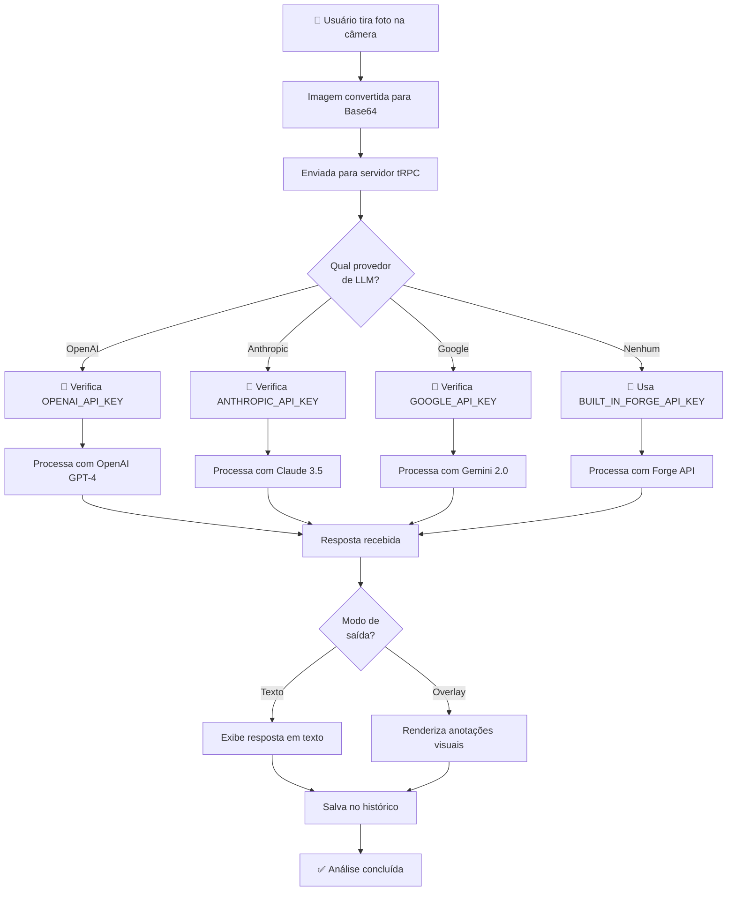
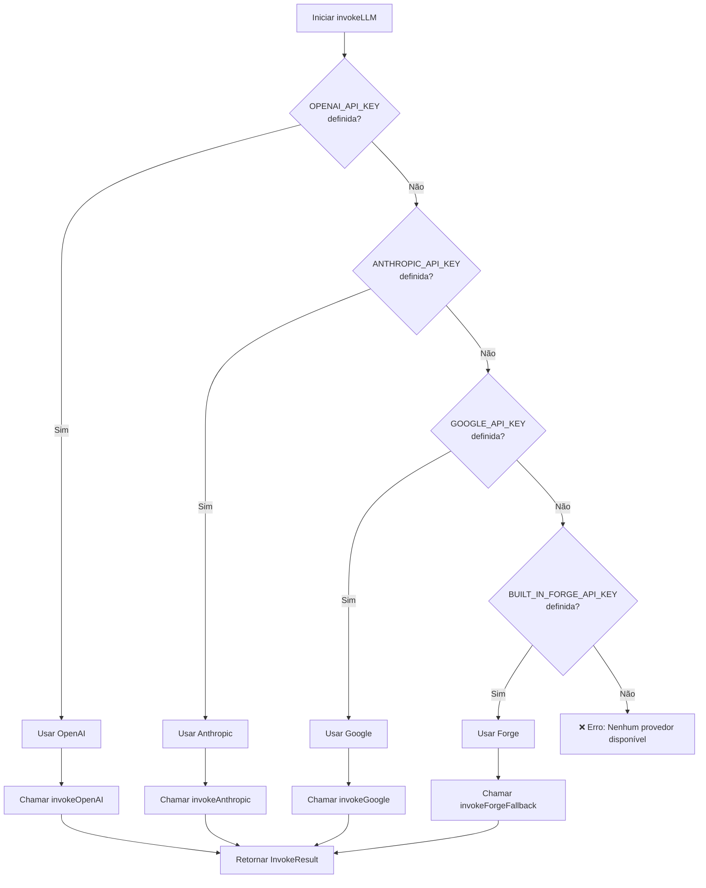
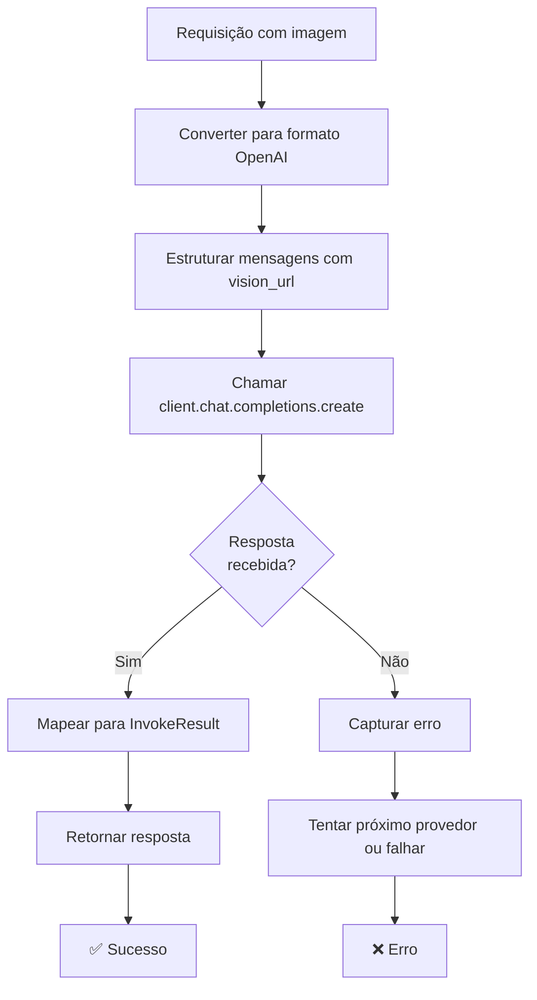
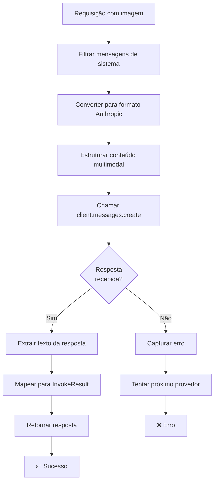
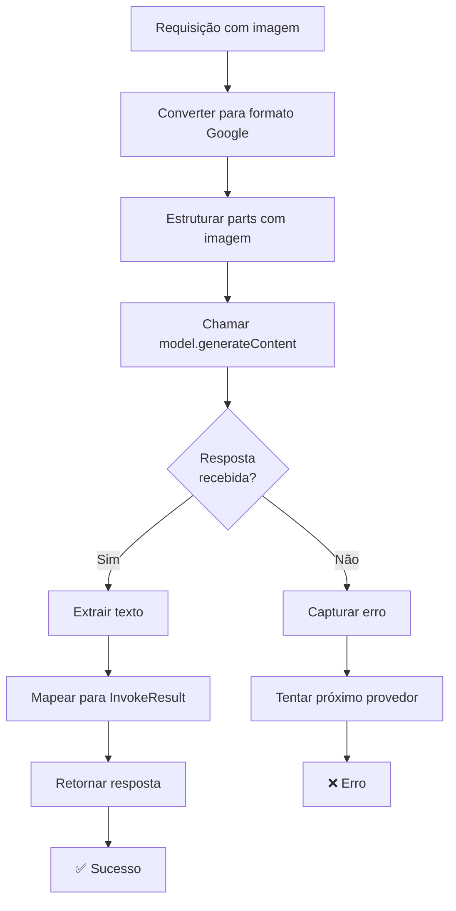
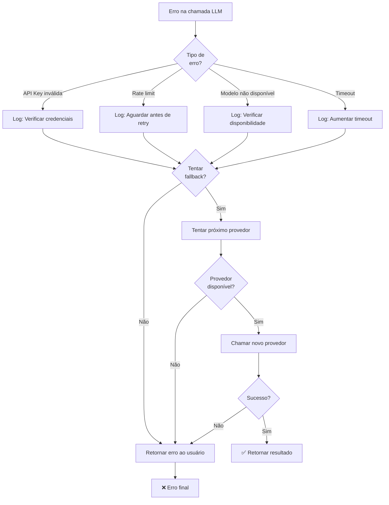
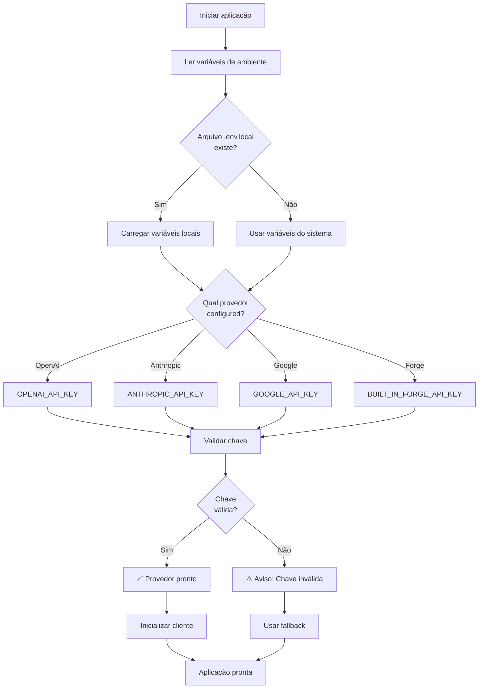
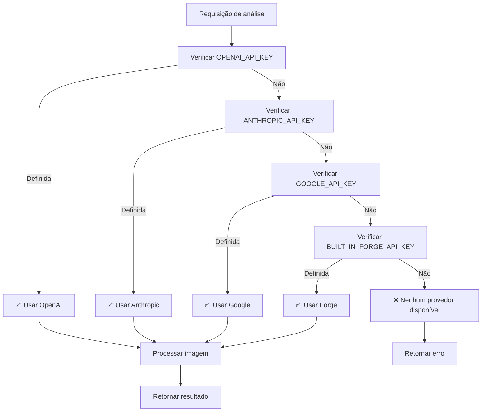
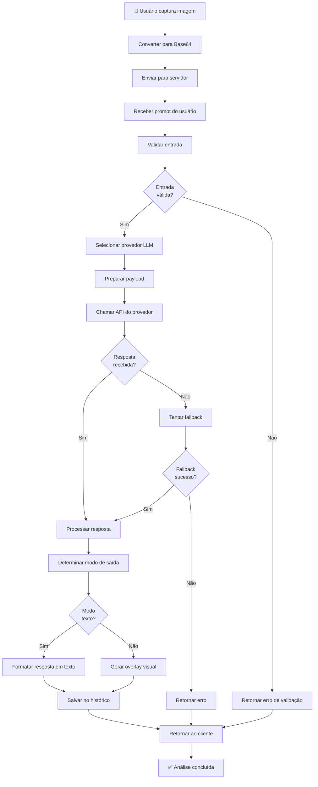
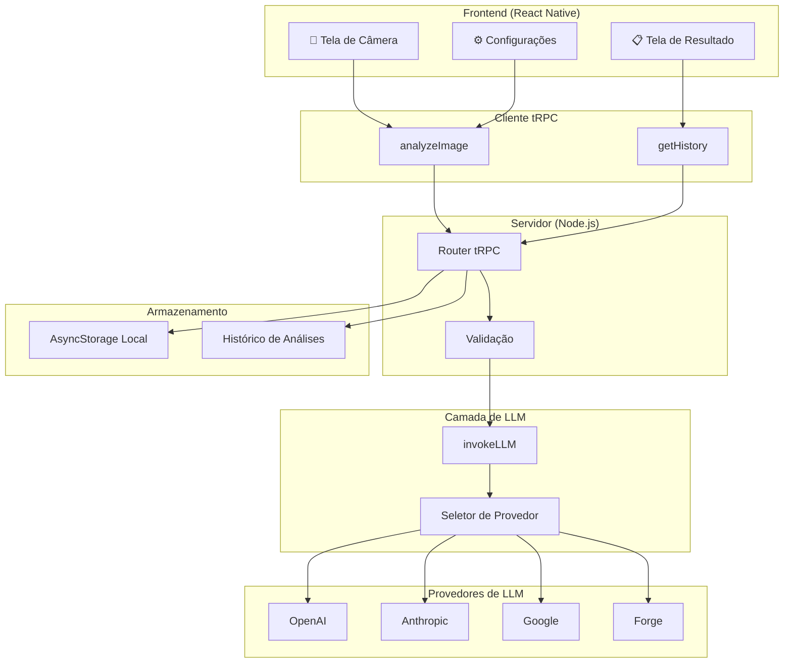

# Diagrama de Fluxo - Integração de LLMs

## 1. Fluxo Geral de Processamento de Imagem

## 2. Fluxo de Seleção de Provedor

## 3. Fluxo de Integração OpenAI

## 4. Fluxo de Integração Anthropic

## 5. Fluxo de Integração Google Gemini

## 6. Fluxo de Tratamento de Erros

## 7. Fluxo de Configuração de Ambiente

## 8. Fluxo de Decisão de Provedor (Prioridade)

## 9. Fluxo Completo de Análise de Imagem

## 10. Arquitetura de Camadas

## Legenda

- 📱 = Interface do usuário
- 🔑 = Chave de API
- ✅ = Sucesso
- ❌ = Erro
- ⚠️ = Aviso
- 🎥 = Câmera
- 📋 = Dados
- ⚙️ = Configurações

## Notas Importantes

1. **Prioridade de Provedores**: OpenAI > Anthropic > Google > Forge
2. **Fallback Automático**: Se um provedor falhar, tenta o próximo
3. **Variáveis de Ambiente**: Defina apenas UM provedor por vez
4. **Tratamento de Erros**: Cada provedor tem seu próprio tratamento
5. **Cache**: Respostas podem ser cacheadas para melhor performance
